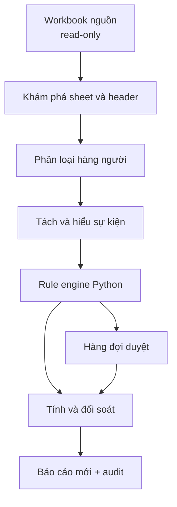

# Kiến trúc hệ thống

## 1. Phong cách kiến trúc

Ứng dụng được thiết kế như một pipeline theo lô, tách phần xử lý xác định khỏi phần AI không xác định. Dữ liệu trung gian là bất biến theo từng stage; stage sau bổ sung kết quả thay vì sửa mất dấu stage trước.

## 2. Các thành phần

### 2.1 Input Guard

- Xác thực phần mở rộng, khả năng đọc và số sheet.
- Tính SHA-256 trước xử lý.
- Mở workbook ở chế độ chỉ đọc/dữ liệu phù hợp.
- Ghi nhận metadata nhưng không lưu bản workbook vào log.
- Implementation hiện tại tại `point_audit.ingestion.WorkbookReader` chỉ chấp nhận đúng một sheet, mở hai read-only view (`data_only=false/true`) và kiểm tra lại SHA-256 sau khi đóng cả hai view.

### 2.2 Sheet Profiler

- Quét toàn sheet để tìm duy nhất một header có đồng thời `Họ và tên`, `Điểm cộng`, `Điểm trừ`, `Tổng`, `Minh chứng`; không giả định header ở hàng 1.
- Ánh xạ cột vật lý sang tên chuẩn.
- Phân loại toàn bộ hàng, không giả định dữ liệu bắt đầu từ hàng 1 hoặc kết thúc ở dòng trống đầu tiên.
- Tách `PERSON_ROW` khỏi summary/footer bằng nhiều tín hiệu.
- Baseline hiện tại nhận dòng học sinh bằng TT số và/hoặc Họ và tên, dừng ở `TỔNG HỢP`, `Thành tích lớp`, `GVCN`, đồng thời đọc `ScoringPeriod` từ vùng tiêu đề phía trên.

### 2.3 Source Extractor

- Tạo `IngestedStudentRow` và `RawWorkbookRow` cho mỗi hàng người.
- Giữ giá trị hiển thị và giá trị parse của điểm nguồn.
- Tạo `RawCell` cho cột Minh chứng với row/column index, tên cột vật lý và nguyên văn.
- Dùng `Decimal` cho điểm parse được, giữ công thức và cached value riêng; kiểm tra sơ bộ công thức tổng và thêm `ROW_FORMULA_MISMATCH` mà không sửa dữ liệu.
- Ngày sinh được parse như thuộc tính người từ Excel date, chuỗi hoặc serial; tuyệt đối không dùng làm ngày sự kiện.

### 2.4 Deterministic Segmenter

- Tách trên xuống dòng/chấm phẩy và dấu phẩy an toàn.
- Nhận diện pattern ngày, số thập phân, delta và ngoặc để tránh cắt sai.
- Gán span bắt đầu/kết thúc trong chuỗi nguồn.
- Đánh dấu đoạn cần Semantic Parser.

### 2.5 Semantic Parser

Gồm hai adapter có cùng hợp đồng:

- Parser Python: regex, từ điển môn, ngày, delta, alias sự kiện.
- Adapter AI: chỉ dùng khi heuristic không đủ; nhận tối thiểu đoạn văn cần thiết và trả JSON theo schema.

Python hợp nhất/kiểm tra kết quả. AI không được trả `expected_delta`, `final_delta`, rule ID được chọn hay bất kỳ tổng nào. Nếu model vẫn trả các trường cấm, output bị từ chối.

Baseline thuần Python hiện tại tại `point_audit.parsing.parse_event_candidate`:

- ưu tiên delta có dấu được viết trực tiếp và lưu thành `declared_delta`;
- nhận diện độc lập điểm môn, môn học, ngày và `EventCategory`;
- dùng `ScoringPeriod` chỉ để suy ra duy nhất năm của ngày/tháng;
- giữ span tuyệt đối trên `RawCell.raw_text` cho subject, academic score, ngày và delta;
- không gọi rule engine và luôn để trống expected/final delta cùng rule match.

### 2.6 Normalizer

- Chuẩn hóa Unicode, khoảng trắng, chữ hoa/thường và alias để khớp.
- Chuyển dấu phẩy/chấm thập phân sang `Decimal` sau khi xác định token số.
- Chuẩn hóa ngày sang ISO khi có đủ thông tin; giữ đồng thời text ngày gốc.
- Tạo `normalized_content`; không ghi đè `raw_text`.

### 2.7 Rule Engine

- Nạp `RuleCatalog` có version và checksum.
- Lọc rule theo thời gian hiệu lực, loại sự kiện, môn, ngưỡng điểm và thuộc tính có cấu hình.
- Sắp thứ tự theo priority rõ ràng.
- Trả `NO_MATCH`, `ONE_MATCH` hoặc `AMBIGUOUS_MATCH` cùng trace.
- Chỉ Rule Engine được tạo `expected_delta`.

### 2.8 Conflict & Duplicate Detector

- So sánh declared/expected theo chính sách Decimal.
- Sinh `RULE_CONFLICT` nhưng không chọn bên thắng.
- Tạo fingerprint dựa trên person, normalized content, date, subject score và delta để tìm ứng viên trùng.
- Chỉ đánh dấu nhóm nghi trùng; quyết định giữ/loại thuộc reviewer.

### 2.9 Review Service

- Trình bày raw text, nguồn, parse, rule trace và cảnh báo.
- Cho phép `USE_DECLARED`, `USE_EXPECTED`, `SET_CUSTOM`, `REJECT_EVENT`, `EDIT_PARSED_FIELDS`.
- Mọi hành động tạo `ReviewDecision` append-only với reviewer, thời gian và lý do.
- Sửa parsed fields phải chạy lại rule engine trước khi duyệt điểm cuối.

### 2.10 Calculator & Reconciler

- Chỉ đọc các event đủ điều kiện tính.
- Dùng `Decimal` và công thức trong data contract.
- Sinh tổng theo người, chênh lệch, run status và các cảnh báo tổng hợp.
- Không dùng AI.

### 2.11 Report Writer

- Ghi artifact mới với tên không trùng hoặc theo xác nhận người dùng.
- Bao gồm audit JSON/CSV và/hoặc workbook báo cáo theo lựa chọn sau này.
- Tính lại hash nguồn cuối lần chạy và so với hash ban đầu.

## 3. Ranh giới tin cậy AI/Python

| Nhiệm vụ | AI được phép | Python bắt buộc |
|---|---:|---:|
| Đề xuất ranh giới sự kiện | Có | Kiểm tra span/schema |
| Nhận diện ngày/môn/hành động từ câu mơ hồ | Có | Parse lại giá trị và validate |
| Chuẩn hóa dấu thập phân | Không cần | Có |
| Chọn rule | Không | Có |
| Tính `expected_delta` | Không | Có |
| Giải quyết conflict | Không | Có/Người duyệt |
| Điền `final_delta` | Không | Có theo policy/decision |
| Cộng tổng và chênh lệch | Không | Có |

## 4. Luồng một sự kiện

1. `DISCOVERED`: có span và raw text.
2. `PARSED`: semantic fields qua schema validation.
3. `RULE_EVALUATED`: có kết quả khớp rule/trace.
4. `PENDING_REVIEW` hoặc `AUTO_ACCEPTED`.
5. Sau quyết định: `APPROVED` hoặc `REJECTED`.
6. Calculator chỉ nhận `AUTO_ACCEPTED`/`APPROVED` có `final_delta`; `REJECTED` được bỏ qua có dấu vết.

Các stage xử lý và `review_status` là hai khái niệm khác nhau để tránh dùng một enum cho cả tiến trình kỹ thuật lẫn quyết định nghiệp vụ.

## 5. Xử lý lỗi

- Lỗi toàn cục: file không đọc được, sai số sheet, không tìm thấy header/cột bắt buộc, rule catalog lỗi → dừng run, không xuất kết quả như thành công.
- Lỗi theo hàng/ô: số điểm gốc không hợp lệ, AI timeout, segmentation mơ hồ → cô lập record, tiếp tục các hàng khác, đánh dấu run `PARTIAL` hoặc `PROVISIONAL`.
- Retry AI hữu hạn với idempotency key; sau retry thất bại chuyển duyệt thủ công.
- Mọi exception được ánh xạ sang mã lỗi ổn định, không lộ dữ liệu nhạy cảm.

## 6. Tính xác định và phiên bản

Mỗi run ghi:

- application version;
- data contract version;
- rule catalog version + checksum;
- column alias/config version;
- model, prompt và schema version nếu dùng AI;
- source SHA-256;
- các quyết định duyệt được áp dụng.

Kết quả AI có thể cache theo hash của raw segment + prompt/model/schema version. Phép tính cuối luôn có thể chạy lại không cần AI nếu dữ liệu parsed và review decisions đã được lưu.

## 7. Triển khai đề xuất ban đầu

Thiết kế phù hợp một CLI/library Python trước, sau đó thêm giao diện duyệt. Các module dự kiến (chỉ là ranh giới, chưa phải code): `ingest`, `profiling`, `parsing`, `ai_adapter`, `rules`, `review`, `calculation`, `reporting`, `contracts`.

Các dependency cụ thể chỉ được chọn ở milestone triển khai sau benchmark file mẫu.
